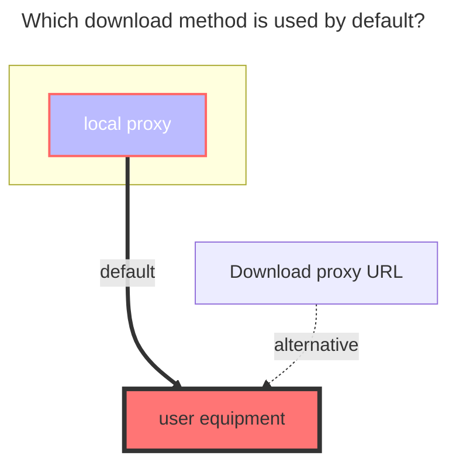

---
# This is the icon of the page
icon: iconfont icon-state
# This control sidebar order
order: 111
# A page can have multiple categories
category:
  - Guide
# A page can have multiple tags
tag:
  - Storage
  - Guide
  - "Native Rroxy"
  - Official
# this page is sticky in article list
sticky: true
# this page will appear in starred articles
star: true
---
# Google Drive
Supports team drives (fill in the directory ID of the team drive for the root directory ID)

## 1. Necessary Conditions
::: warning Notes
1. The machine where the OpenList service is deployed must first be able to connect to Google Drive.
2. The Google Drive API service must be activated. For activation instructions, see [Enabling the Google Drive API](#enabling-the-google-drive-api).
> Refer to [Google Workspace > Google Drive > Guide](https://developers.google.com/workspace/drive/api/quickstart/js): https://developers.google.com/workspace/drive/api/quickstart/js
:::

## 2. Preparations for Integration

### 2.1. Enabling the Google Drive API
1. On the [guide page](https://developers.google.com/workspace/drive/api/quickstart/js), find the "Enable API" button, click to enter the quick activation interface, and complete the activation after clicking "Next" and "Confirm".
2. You can also visit the [Google Drive API management interface](https://console.cloud.google.com/apis/library/drive.googleapis.com), find the "Enable" button at the top, and wait for the activation to complete after clicking.
3. **Quota and System Limit Management** (optional): Switch to the "Quota and System Limits" tab and set appropriate quotas and limits according to your usage and needs.

### 2.2. Creating an OAuth Client (optional, no need to create if using OpenList's provided client)
1. In the [Credentials interface](https://console.cloud.google.com/apis/credentials?hl=zh-cn), click the "Create Credentials" drop-down menu, and select and click "OAuth Client ID".
2. In the pop-up window, select "Web Application" and fill in the application name.
3. In "Authorized redirect URIs", fill in `https://api.oplist.org/googleui/callback`.
4. Click the "Create" button to complete the creation of the OAuth client. **Note**: Please copy and save the "Client ID" and "Client Secret" for subsequent use.
5. Add yourself to the test users: find the "Target" menu on the left, click to enter, find the "+ Add User" button below "Test Users", click, enter your Google account email address, and click "Add".

### 2.3. Obtaining the Access Token and Refresh Token
1. Open the [OpenList Google Authorization Page](https://api.oplist.org/) **If self-hosted, visit the self-hosted service**.
2. In the drop-down box on the page, select `Google Drive Team`.

3. If you created an OAuth client ID in the above steps, enter the newly created "Client ID" and "Client Secret" in the following input boxes.

Otherwise, check ☑️ to use the API provided by OpenList. **⚠️ If using community public welfare services, the built-in client ID and application secret of the community public welfare service are used at this time**.

4. Click the "Get Authorization" button, and the system will jump to the Google authorization page. Log in to your Google account and authorize OpenList to access your Google Drive.

5. If the prompt "This app is not verified by Google" appears, click "Advanced", then click "Go to oplist.org (unsafe)" to continue. (If self-hosted or using community public welfare services, the domain name here shall be based on the actual domain name of the public welfare service; please screen carefully).

6. Please pay attention to the permission information on the authorization page (in the red box below) to ensure that it only accesses your **Google Drive files**. If you find that the permissions in the public welfare service exceed accessing **Google Drive**, please raise an issue at [openlistteam/docs/issues](https://github.com/openlistteam/docs/issues).

6. After successful authorization, the system will return a "Refresh Token" and "Access Token". Please copy and save the token.

## 3. Adding Google Drive to Alist

### 3.1. Configuration Instructions
#### 3.1.1. **Root Folder ID**
Similar to Alibaba Cloud Drive, it is the last string in the official website URL, such as:

### 3.2. Starting to Add
1. Open the Alist management interface and click "Storage" in the left menu.
2. On the storage list page, click the "Add Storage" button in the upper right corner.
3. Select the driver as `Google Drive`.

4. Enter the mounting path, such as: `google-drive`.
5. Fill in the root folder ID obtained above in "Root Folder ID".
6. Enter your "Oauth Client ID" in "Client ID" and your "Oauth Client Secret" in "Client Secret".
8. Enter the refresh token obtained above in "Refresh Token" (if not obtained, please refer to [Preparations for Integration](#2-preparations-for-integration)).

9. Click the "Add" button to complete adding Google Drive.

