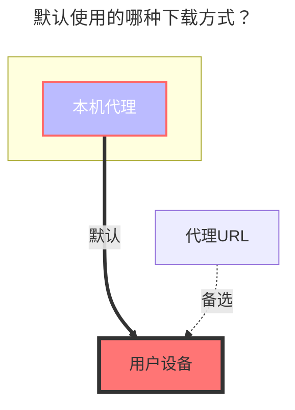

---
# This is the icon of the page
icon: iconfont icon-state
# This control sidebar order
order: 111
# A page can have multiple categories
category:
  - Guide
# A page can have multiple tags
tag:
  - Storage
  - Guide
  - "本地代理"
  - "官方"
# this page is sticky in article list
sticky: true
# this page will appear in starred articles
star: true
---

# 谷歌云盘
支持团队盘（根目录ID填写团队盘的目录ID）
## 1.必要条件
::: warning 注意事项

1. 搭建OpenList服务的机器首先要能连接到Google网盘才可以喔~
2. 必须启动谷歌云盘API服务，启用方式见[启用 Google Drive API 的 API](#启用-google-drive-api-的-api)
> 参考 [Google Workspace>Google Drive>指南](https://developers.google.com/workspace/drive/api/quickstart/js): https://developers.google.com/workspace/drive/api/quickstart/js
:::

## 2.准备接入
### 2.1.启用 Google Drive API 的 API
1. 在[指南页面](https://developers.google.com/workspace/drive/api/quickstart/js)中找到`启用API`按钮，点击进入快捷开启界面，点击下一步以及确认后，即可完成开启。
2. 也可以访问[谷歌云盘API功能管理界面](https://console.cloud.google.com/apis/library/drive.googleapis.com)，在上方找到`启用`按钮，点击后等待启用完成。
3. `配额和系统限制管理`（可选）:切换到`配额和系统限制`选项卡，根据你的使用情况和需求，设置合适的配额和限制。

### 2.2.创建 OAuth 客户端（可选，如果使用OpenList提供的，则不用创建）
1. 在[凭据界面](https://console.cloud.google.com/apis/credentials?hl=zh-cn)中，点击`创建凭据`下拉菜单，选择和点击`OAuth 客户端 ID`
2. 在弹出的窗口中，选择`Web 应用`，填写应用名称
3. 在`授权的重定向 URI`中，填写 `https://api.oplist.org/googleui/callback`
4. 点击`创建`按钮，完成 OAuth 客户端的创建。注：请复制和保存`客户端 ID`和`客户端密钥`，后续需要使用。
5. 将自己添加到测试用户中，在左侧找到`目标对象`菜单，点击进入后，找到`测试用户`下方的`+ Add User`按钮，点击后输入你的 Google 账号邮箱地址，点击添加即可。

### 2.3.获取`访问密钥`和`刷新密钥`
1. 打开[OpenList Google 授权页面](https://api.oplist.org/) **如果自建，请访问自建服务**
2. 在页面中下拉框王选择`Google Drive Team`

3. 如果在上面的步骤中创建了 OAuth 客户端 ID，请在下方输入框中填写刚才创建的`客户端 ID`和`客户端密钥`

否则勾选☑️使用 OpenList 提供的API。**⚠️如果使用的社区公益服务，此时使用的是社区公益服务内置的客户端ID和应用机密**

4. 点击`获取授权`按钮，系统会跳转到 Google 授权页面，登录你的 Google 账号，并授权 OpenList 访问你的 Google Drive。

5. 如果出现`此应用未经 Google 验证`的提示，请点击`高级`，然后点击`转至oplist.org（不安全）`继续。（如果是自建或者社区公益服务，则此处域名以实际公益服务的域名为准，请仔细甄别）。

6. 请注意授权页面上（下图红色框内）的权限信息，确保**只是**访问你的 **谷歌云端硬盘文件**，如果在公益服务中发现该权限不仅仅是访问**谷歌云端硬盘**，请在[openlistteam/docs/issues](https://github.com/openlistteam/docs/issues)提起issues。

6. 授权成功后，系统会返回一个`刷新密钥`和`访问密钥`，请复制并保存该令牌。

## 3.在alist中添加谷歌云盘

### 3.1.配置说明
#### 3.1.1.**根文件夹 ID**

与阿里云盘类似，官网 URL 的最后一个字符串，如：

### 3.2.开始添加
1. 打开 Alist 的管理界面，点击左侧菜单中的`存储`。
2. 在存储列表页面，点击右上角的`添加存储`按钮。
3. 选择驱动为`谷歌云盘（Google Drive）`。

4. 输入挂载路径，如：`google-drive`。
5. 在`根文件夹 ID`中填写上面获取的根文件夹 ID。
6. 在`客户端ID`中填写你的`Oauth 客户端 ID`，在`客户端密钥`中填写你的`Oauth 客户端密钥`
8. 刷新令牌中填写上面获取的刷新令牌（如未获取，请参考[准备接入](#2准备接入)）。

9. 点击`添加`按钮，完成谷歌云盘的添加。

